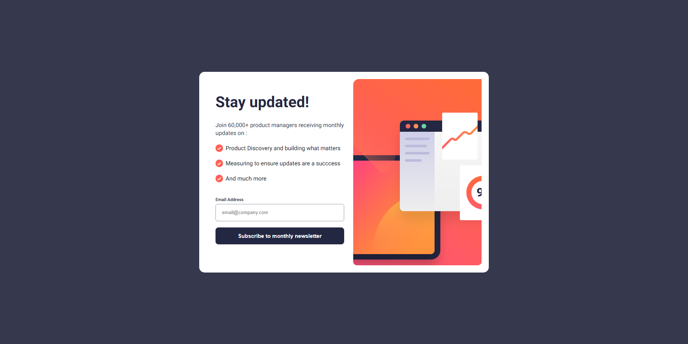

# Frontend Mentor - Newsletter sign-up form with success message solution

This is a solution to the [Newsletter sign-up form with success message challenge on Frontend Mentor](https://www.frontendmentor.io/challenges/newsletter-signup-form-with-success-message-3FC1AZbNrv). Frontend Mentor challenges help you improve your coding skills by building realistic projects. 

## Table of contents

- [Overview](#overview)
  - [The challenge](#the-challenge)
  - [Screenshot](#screenshot)
  - [Links](#links)
- [My process](#my-process)
  - [Built with](#built-with)
  - [What I learned](#what-i-learned)
  - [Continued development](#continued-development)
  - [Useful resources](#useful-resources)
- [Author](#author)
- [Acknowledgments](#acknowledgments)

**Note: Delete this note and update the table of contents based on what sections you keep.**

## Overview

### The challenge

Users should be able to:

- Add their email and submit the form
- See a success message with their email after successfully submitting the form
- See form validation messages if:
  - The field is left empty
  - The email address is not formatted correctly
- View the optimal layout for the interface depending on their device's screen size
- See hover and focus states for all interactive elements on the page

### Screenshot



### Links

- Solution URL: [https://github.com/HarisMI40/challenge-frontend/tree/main/newsletter-sign-up-with-success-message](https://github.com/HarisMI40/challenge-frontend/tree/main/newsletter-sign-up-with-success-message)
- Live Site URL: [https://harismi40.github.io/challenge-frontend/newsletter-sign-up-with-success-message/](https://harismi40.github.io/challenge-frontend/newsletter-sign-up-with-success-message/)

## My process

### Built with

- Semantic HTML5 markup
- CSS custom properties
- Flexbox
- Mobile-first workflow

### What I learned

i'm learn for use image for list with different ways

```css
.card .card-main .body ul li {
  background: url(./assets/images/icon-list.svg) no-repeat; /* <-- change `left` & `top` too for extra control */
  padding-left: 28px;
  list-style: none;
}
```

### Continued development

i want continue focusing how to use css seletor effectiveness one of the sources that I will study is https://csswizardry.com/2011/09/writing-efficient-css-selectors/

### Useful resources

- [Stack Overflow](https://stackoverflow.com/questions/1708833/adjust-list-style-image-position) - This helped me solving problem with image list.
- [cssgradient.io](https://cssgradient.io/) - This helped me for create gradient color

## Author

- Website - [Haris Maulana](https://www.harismi.my.id)
- Frontend Mentor - [@yourusername](https://www.frontendmentor.io/profile/yourusername)
